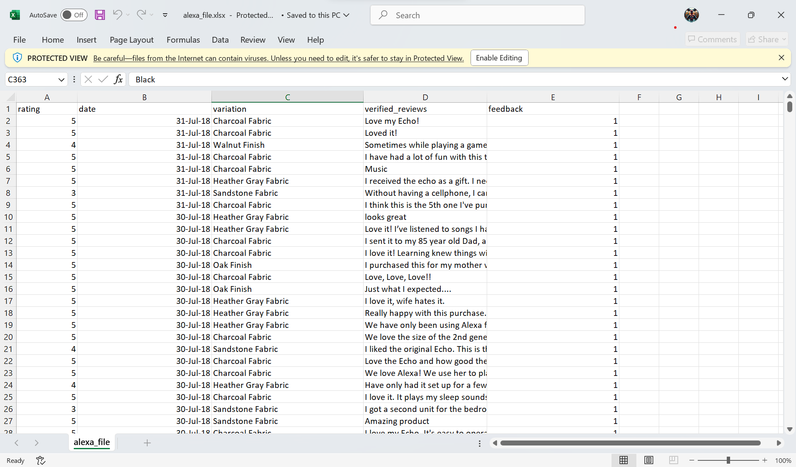

```{r setup, include=FALSE}
knitr::opts_chunk$set(echo = TRUE)
```

1. 5 x 5 Zero Matrix
```{r}
vectorA <- c(1, 2, 3, 4, 5)
my_matrix <- matrix(0, nrow = 5, ncol = 5)

for (i in 1:5) {
  for (j in 1:5) {
    my_matrix[i, j] <- vectorA[abs(i - j) + 1] - 1
  }
}

print(my_matrix)

```

2. Print string "*" using for loop.
```{r}
for (i in 1:5){
  for (j in 1:i){
    cat("* ")
  }
  cat("\n")
}
```

3. Print a Fibonacci sequence from the first input until the value reaches 500.
```{r}
printFibonacci <- function(start){
  first <- 0
  second <- 1
  next_num <- 0
  
  if (start == 1){
      cat(first, "", second, "", second, " ")
  }
  
  for (i in 0:start){
    next_num <- first + second
    first <- second
    second <- next_num
  }
  
  repeat{
    if (next_num > 500) break
    cat(next_num, " ")
    next_num <- first + second
    first <- second
    second <- next_num
  }
}

#start <- readline(prompt = "Enter starting term: ")
start <- 1
printFibonacci(start)
```

4. Import shoe size dataset
```{r}
#A. Imported the dataset and displayed the first 6 rows
shoe_data <- read.csv("shoesize_data.csv")
shoe_data[(1:6), ]
```

```{r}
#B. Subset for gender
male <- subset(shoe_data, Gender == "M")
male

female <- subset(shoe_data, Gender == "F")
female
```

```{r}
#C. Barplot for genders
num_gender <- table(shoe_data$Gender)

barplot(num_gender,
        main = "Number of Males and Females",
        xlab = "Gender",
        ylab = "Count",
        col = c("Pink", "Blue"),
        names.arg = c("Female", "Male"),
        legend = rownames(num_gender))
```


5. Monthly income pie chart of Dela Cruz Family.
```{r}
category <- c("Food", "Electricity", "Savings", "Miscellaneous")
value <- c(60, 10, 5, 25)
color = c("Yellow", "Blue", "Green", "Red")
percentage <- round(value / sum(value) * 100)
percent_label <- paste(category, percentage, "%")

pie(
  value, 
  col = color,
  main = "Dela Cruz Expenses",
  label = percent_label
)

legend("topright", category, fill = color)
```


6. Iris Dataset
```{r}
#A. Check structure of iris dataset
data(iris)
str(iris)

#Output displays a data frame that contains the length and width of Sepal and Petal
```

```{r}
#B. Object to store the mean of sepal length, sepal width, petal length, and petal width
data_means <- c(
  Sepal.Length = mean(iris$Sepal.Length),
  Sepal.Width = mean(iris$Sepal.Width),
  Petal.Length = mean(iris$Petal.Length),
  Petal.Width = mean(iris$Petal.Width)
)
data_means
```

```{r}
#C. Pie chart for Species distribution
iris_species <- table(iris$Species)
species_color <- c("Blue", "White", "Red")
pie(
  iris_species,
  main = "Species Distribution",
  col = species_color
)
legend("topright", names(iris_species), fill = species_color, title = "Species")
```

```{r}
#D. Subset of the species setosa, versicolor, and virginica.
setosa <- subset(iris, Species == "setosa")
versicolor <- subset(iris, Species == "versicolor")
virginica <- subset(iris, Species == "virginica")
tail(setosa)
tail(versicolor)
tail(virginica)
```

```{r}
#E. Scatterplot of the sepal.length and sepal.width
data(iris)

iris$Species <- as.factor(iris$Species)

colors <- c("red", "green", "blue")
pch_symbols <- c(16, 17, 18) 

plot(iris$Sepal.Length, iris$Sepal.Width,
     col = colors[iris$Species],
     pch = pch_symbols[iris$Species],
     main = "Iris Dataset",
     sub = "Sepal Width and Length",
     xlab = "Sepal Length",
     ylab = "Sepal Width")

legend("topright", legend = levels(iris$Species),
       col = colors, pch = pch_symbols)
```

F. 
- The scatterplot shows the relationship between Sepal.Length and Sepal.Width across three species in the iris dataset: setosa, versicolor, and virginica.
- Setosa (red circles) is distinctly clustered with smaller sepal lengths, making it easily distinguishable from the other species.
- Versicolor (green triangles) and Virginica (blue diamonds) show overlapping ranges in both dimensions, with virginica generally having the longest sepals.


7. Basic Cleaning and Transformation of Objects
```{r}
#Imported alexafile
library(readxl)
alexa_file <- read_xlsx("alexa_file.xlsx")
alexa_file


```

```{r}
#A. Rename the white and black variants using gsub() function.
alexa_file$variation <- gsub("Black  Dot", "BlackDot", alexa_file$variation)
alexa_file$variation <- gsub("Black  Plus", "BlackPlus", alexa_file$variation)
alexa_file$variation <- gsub("Black  Show", "BlackShow", alexa_file$variation)
alexa_file$variation <- gsub("Black  Spot", "BlackSpot", alexa_file$variation)
alexa_file$variation <- gsub("White  Spot", "WhiteSpot", alexa_file$variation)
alexa_file$variation <- gsub("White  Show", "WhiteShow", alexa_file$variation)
alexa_file$variation <- gsub("White  Plus", "WhitePlus", alexa_file$variation)
alexa_file$variation <- gsub("White  Dot", "WhiteDot", alexa_file$variation)

alexa_file$variation[1050:2000]
```

```{r}
#B. Get the total number of variation
library(dplyr)

alexa_var <- alexa_file %>%
  count(alexa_file$variation)
  alexa_var

save(alexa_var, file = "variations.RData")
```

```{r}
#C. Create a barplot from variations.RData
load("variations.RData")

barplot(
  alexa_var$n,
  col = c("violet", "blue", "green", "yellow"),
  main = "Total Number Of Each Variations",
  ylab = "Variants",
  names.arg = alexa_var$`alexa_file$variation`,         
  las = 2      
)
```

```{r}
#D. Create a barplot of black and white variations
load("variations.RData")

par(mfrow = c(1, 2))

black_var <- alexa_var %>% 
  filter(`alexa_file$variation` %in% c("Black", "BlackDot", "BlackPlus", "BlackShow", "BlackSpot"))

barplot(
  height = black_var$n, 
  names.arg = black_var$`alexa_file$variation`, 
  col = c("purple", "red", "orange", "yellow", "lightgreen"),               
  main = "Black Variants",
  xlab = "Total Numbers",                         
  ylab = "Variations",
  las = 2
)

white_var <- alexa_var %>% 
  filter(`alexa_file$variation` %in% c("White", "WhiteDot", "WhitePlus", "WhiteShow", "WhiteSpot"))

barplot(
  height = white_var$n,  
  names.arg = white_var$`alexa_file$variation`, 
  col = c("purple", "red", "orange", "yellow", "lightgreen"),              
  main = "White Variants",
  xlab = "Total Numbers",                         
  ylab = "Variations",
  las = 2
)
```


